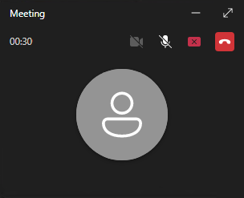

# MSTeams-ScreenSharePopupHider

This project provides a background application designed to automatically dismiss the persistent popup that appears at the top of the screen when sharing your screen using Microsoft Teams. The goal is to enhance the screen-sharing experience by not getting interrupted.

_The above image shows the type of popup that this application helps to dismiss._

Additionally, the application also offers options on how to handle the "Floating participants window".

Users can choose to hide it from the taskbar or hide it completely. This can be easily adjusted via the application's tray icon.

_The "Floating participants window" that can also be hidden._

## Getting Started

### Downloading the Application

1. Navigate to the [Releases](https://github.com/N3uR0TiCV0iD/MSTeams-ScreenSharePopupHider/releases) section of this repository.
You can also find the latest release on the right-hand side of the repository page.

2. Download the latest version of the `MSTeams-ScreenSharePopupHider.exe` file from the assets.

### Running the Application

To run the `MSTeams-ScreenSharePopupHider` application, simply double-click on the `MSTeams-ScreenSharePopupHider.exe` file you downloaded.

No installation is necessary as the application is portable.
