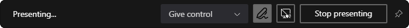

# MSTeams-ScreenSharePopupHider

This project provides a background application designed to automatically dismiss the persistent popup that appears at the top of the screen when sharing your screen using Microsoft Teams. The goal is to enhance the screen-sharing experience by not getting interrupted.

_The above image shows the type of popup that this application helps to dismiss._

## Getting Started

### Downloading the Application

1. Navigate to the [Releases](https://github.com/N3uR0TiCV0iD/MSTeams-ScreenSharePopupHider/releases) section of this repository.
You can also find the latest release on the right-hand side of the repository page.

2. Download the latest version of the `MSTeams-ScreenSharePopupHider.exe` file from the assets.

### Running the Application

To run the `MSTeams-ScreenSharePopupHider` application, simply double-click on the `MSTeams-ScreenSharePopupHider.exe` file you downloaded.

No installation is necessary as the application is portable.

---

**MIT License**

This work is licensed under the MIT License.

Permission is hereby granted, free of charge, to any person obtaining a copy of this software and associated documentation files (the "Software"), to deal in the Software without restriction, including without limitation the rights to use, copy, modify, merge, publish, distribute, sublicense, and/or sell copies of the Software, and to permit persons to whom the Software is furnished to do so, subject to the following conditions:

The above copyright notice and this permission notice shall be included in all copies or substantial portions of the Software.

THE SOFTWARE IS PROVIDED "AS IS", WITHOUT WARRANTY OF ANY KIND, EXPRESS OR IMPLIED, INCLUDING BUT NOT LIMITED TO THE WARRANTIES OF MERCHANTABILITY, FITNESS FOR A PARTICULAR PURPOSE AND NONINFRINGEMENT. IN NO EVENT SHALL THE AUTHORS OR COPYRIGHT HOLDERS BE LIABLE FOR ANY CLAIM, DAMAGES OR OTHER LIABILITY, WHETHER IN AN ACTION OF CONTRACT, TORT OR OTHERWISE, ARISING FROM, OUT OF OR IN CONNECTION WITH THE SOFTWARE OR THE USE OR OTHER DEALINGS IN THE SOFTWARE.

To view a copy of the MIT license, visit [https://opensource.org/licenses/MIT](https://opensource.org/licenses/MIT) or open the "LICENSE" file.
